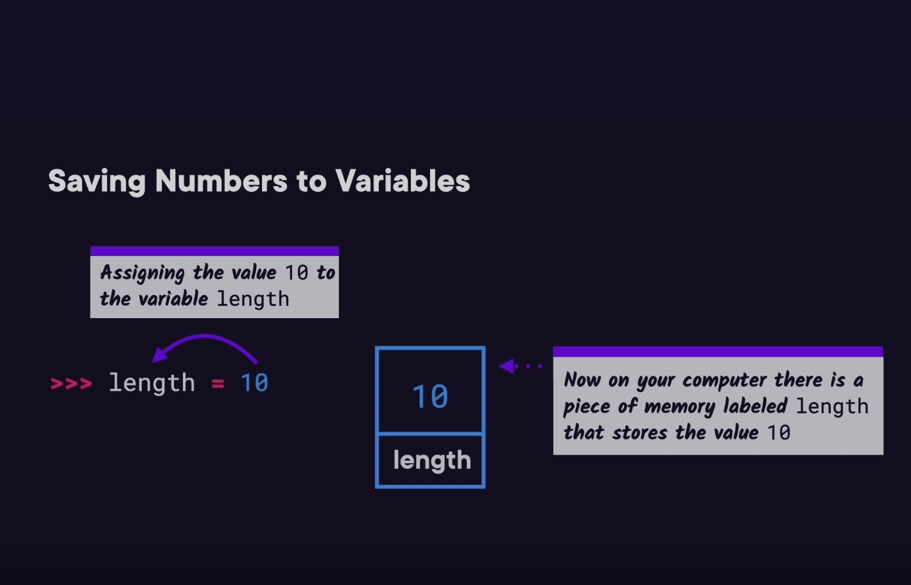

# Python3 Fundamentals

## Run python and explore data types

python infer the type e.g. int, float

## Conditionals and imports

## Lists and loops

## Dictionaries, JSON and pip

## Functions

## Classes and objects

## Working with files

