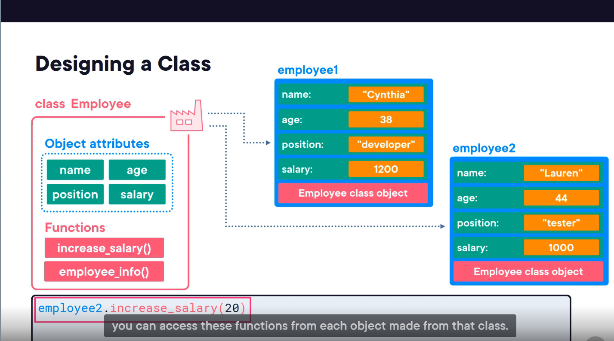
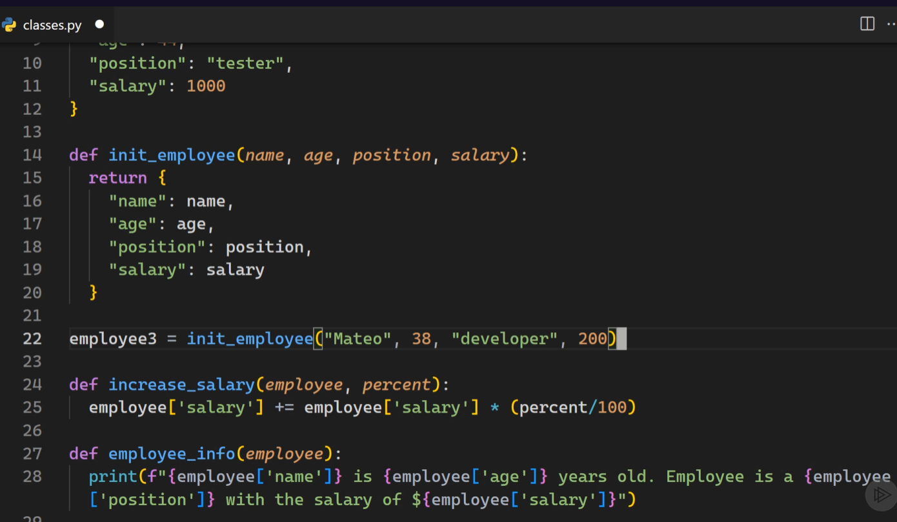
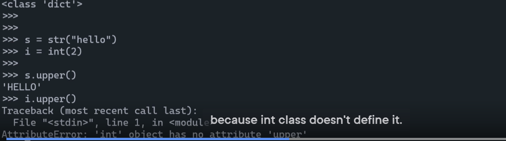
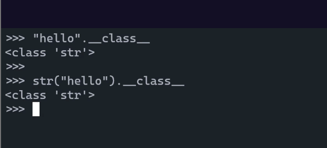

# Classes and Object-oriented Programming in Python3

## Everything is an object

### Working with complex data

Let's say we write a program to manage all the employee of a company. First we need a **data structure** to store this complex data. The data share the same template / structure.
a. Have same group  of attributes. e.g. name, age, position, salary etc
b. Have same functions. e.g. increase salary. pretty print info etc.

1. Using multiple variables to store employee's attributes. e.g. name, salary with prefix to indicate the name of the employee.
    * It's very inconvenient because we will have to create a lot of variables. Each time adding a new employee will need to create a bunch of new variables. Also in a large application there will be a lot of logic / functions and interactions around employees. Dealing with tons of variables will not be maintainable.
    
  
2. Put all the employee's attributes in a **list**
   * Now we only need one variable which is a list to store all the information for an employee.
   * The inconvenience will be we will have to remember which index correspond to which attributes. This can be improved by using dictionary.
   * It's only achievable in python since in other language (strongly typed) a list or other collections cannot store different types of data like putting string and integer in the same list here.
   

3. Use dictionary. That's why dictionary is big part of python. Many attributes of class / objects are stored in a dictionary.
   * Using dictionary solve the indexing issue of using a list. But when we start to have more functions operating on an employee or other relationship between employee and other data like projects, we want to group these code together in a single units. We can already put them in one single file / module. But in OOD we already have a data structure called class. So we don't need to reinvent the wheel.
   * For the functions that play around employee data since it's in a global scope, we will also have to prefix it with employee_ to distinguish with other functions explicitly.
    
    

### Python built-in class

Everything in python is a object.

Why we need a class even for simple object like str or int? Because we want to use the function that operate on the state of an object of that type. We don't need all of the function in the global scope, we can just call the function from the object use dot syntax directly.

Python is a dynamically language where variable is not strongly typed and can store different type of objects different than other statically typed language like c# and c++.

Everything in python is an object. Variable itself doesn't store any information, it's just a reference to an objects. Python store all values inside objects and every object is created from an class. object itself store information of its types. Even function is an object.

## Instantiate objects

## Class inheritance

## Class attributes

## Data classes
