# Collections

## Built-in containers data types

1. List: ordered in **sequence**, mutable, random access by index
2. Dictionary: key value pairs. Keys are unique
3. Tuples: ordered, **immutable**
4. Set: unordered, store **unique** objects

### 1. Lists

List operations


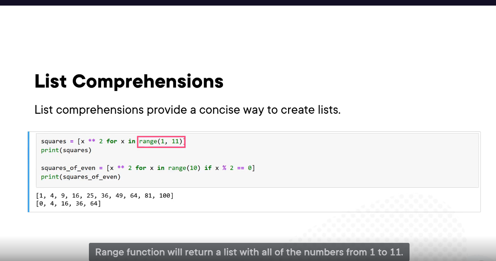

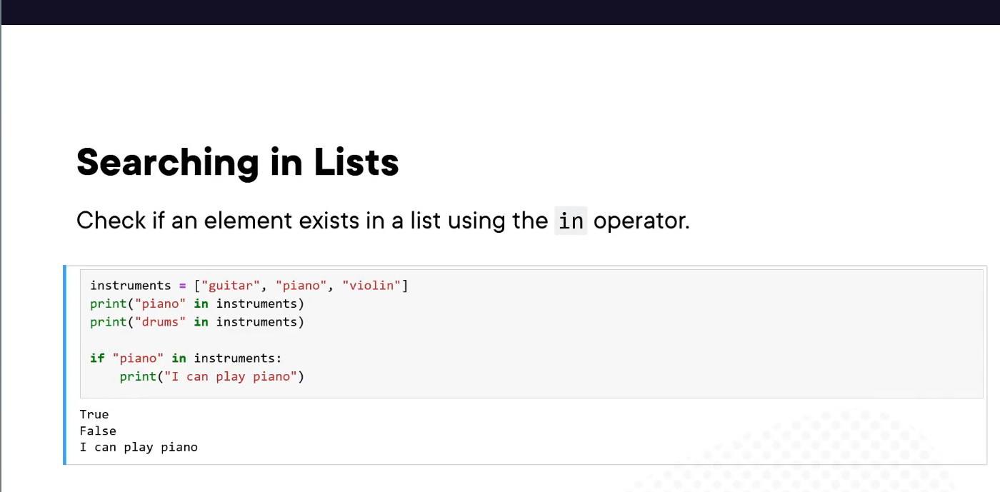

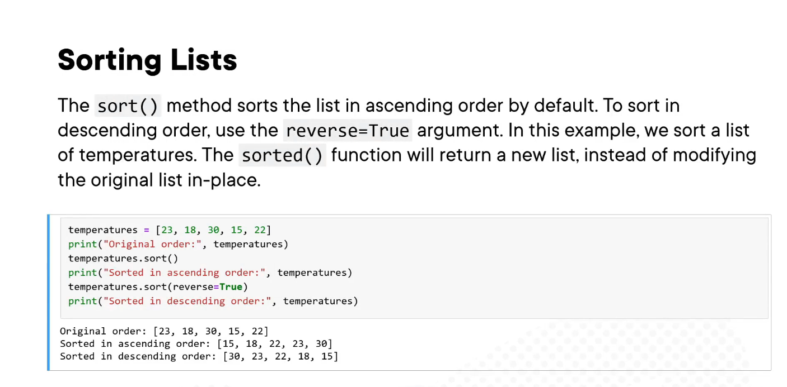


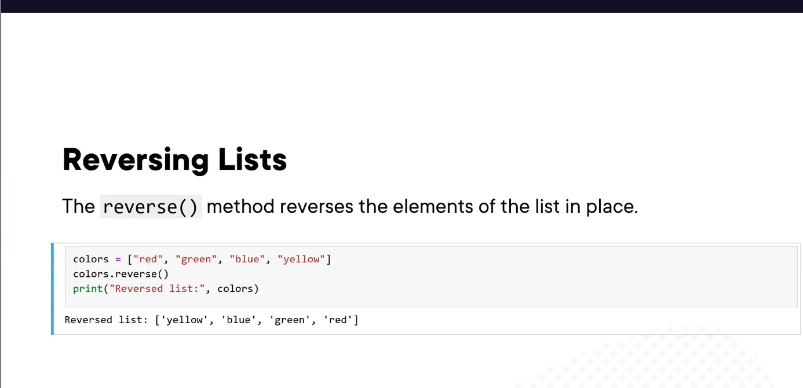


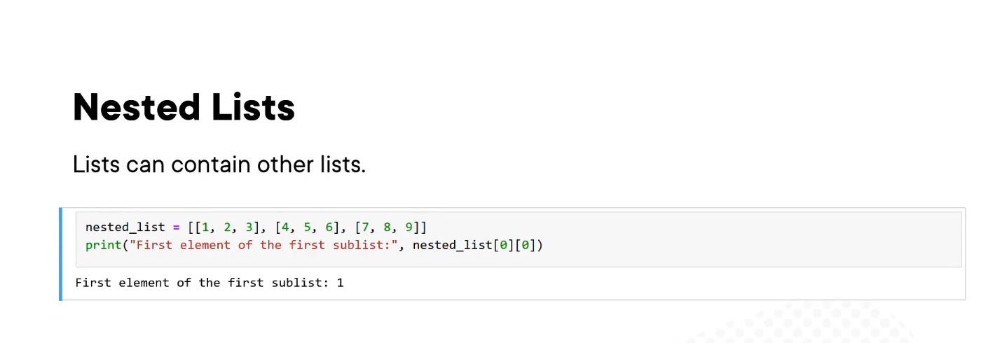


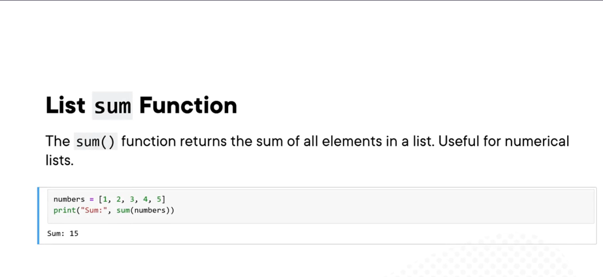


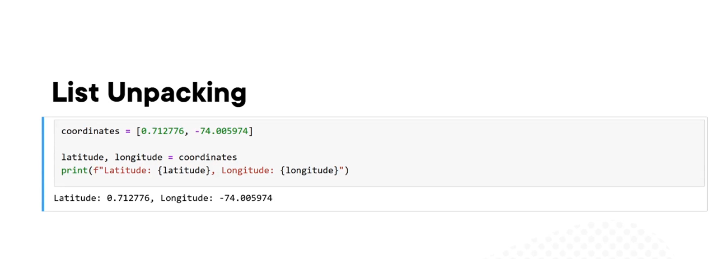


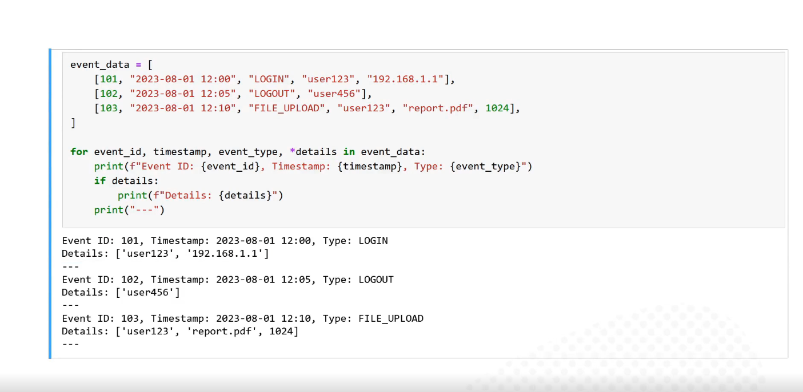


**Overwrite the elements in the lists.**


```python
lst = [1, 2, 3, 4, 5, 6, 7, 8]
lst[:] = [number for number in lst if number % 2 == 0]
```

**iterate both the index and the elements using enumerate function.**

```python
for i, number in enumerate([1, 2, 3, 4, 5]):
    print(f"Element at position {i} is {number}")
```

Using list

1\ Prototyping and Education

Lists are excellent for educational purposes and prototyping due to their simplicity and the intuitive way they map to a real-world concept of a sequence.

2\ 10 most recent logs

```python
recent_events = event_logs[-10:]
```

### 2. Dictionary

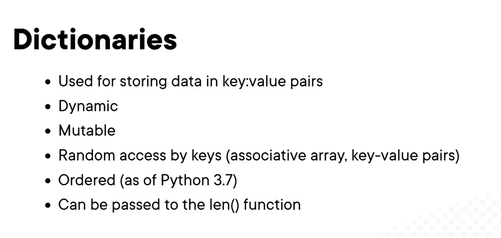

Update elements and merge dictionaries


Remove elements
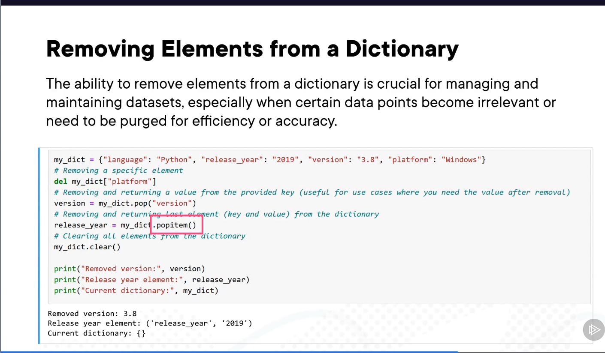

check key existence


**Dictionary comprehensions using curly bracket.**


**shallow copy and deep copy.**

```python
dic = {"name": "python", "age": 32}
copied_dic = dic.copy()

import copy

deeply_copied_dic = copy.deepcopy(dic)
```

**setdefault method.**
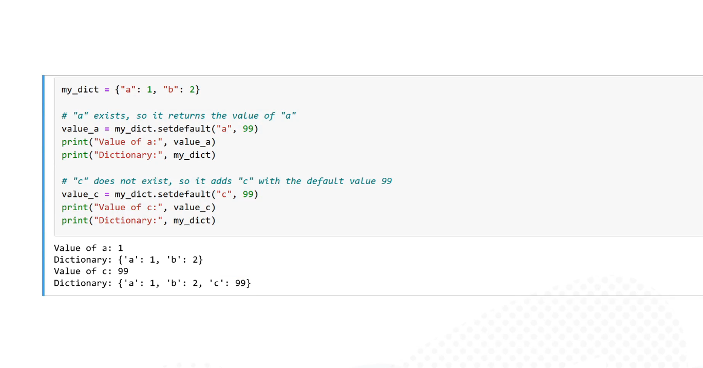

**Sorting dictionaries.**
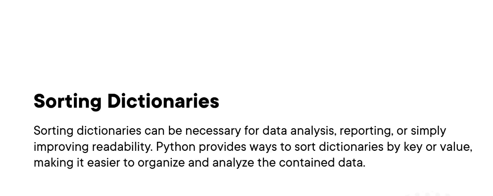

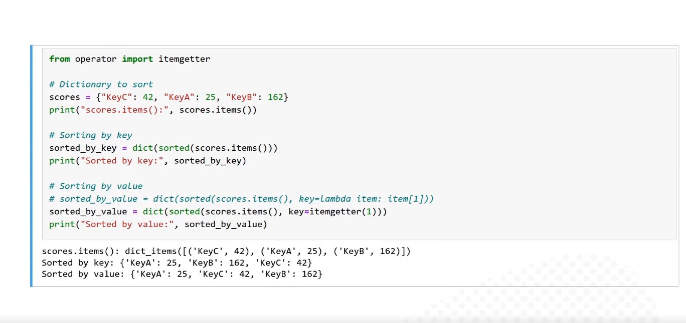

Using dictionary

Since keys are unique so dictionary is optimal for quick look up of information.


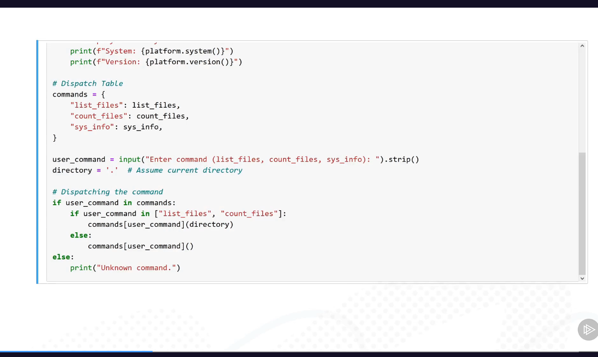

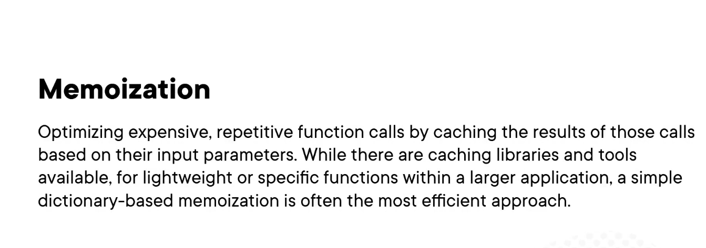


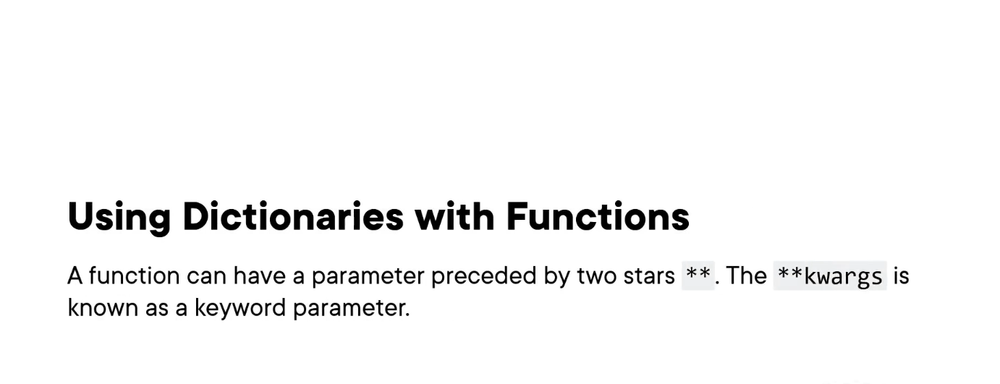


### 3. Tuples

1. ordered sequence, immutable, fixed number of elements
2. create list using brackets `[]` while create tuple use  parenthesis `()` .

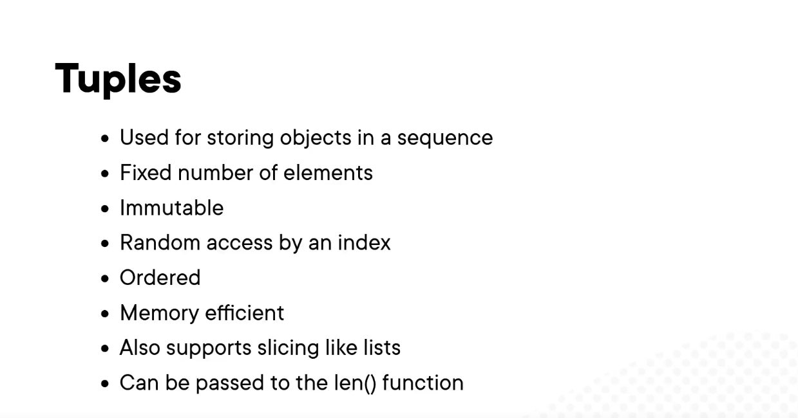

### 4. Set

## Improve efficiency with advanced dictionaries

## Using specialized collection classes

## Customizing built-in data types
